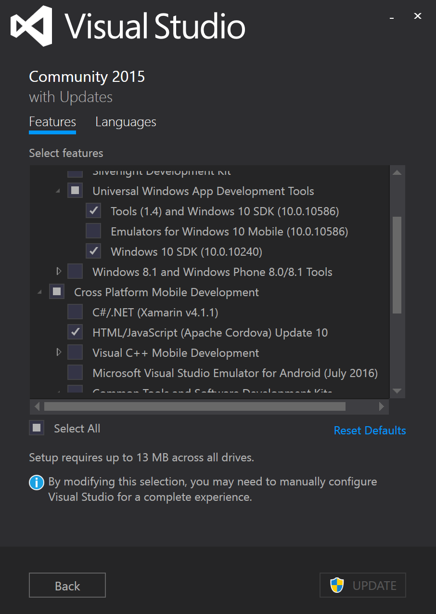
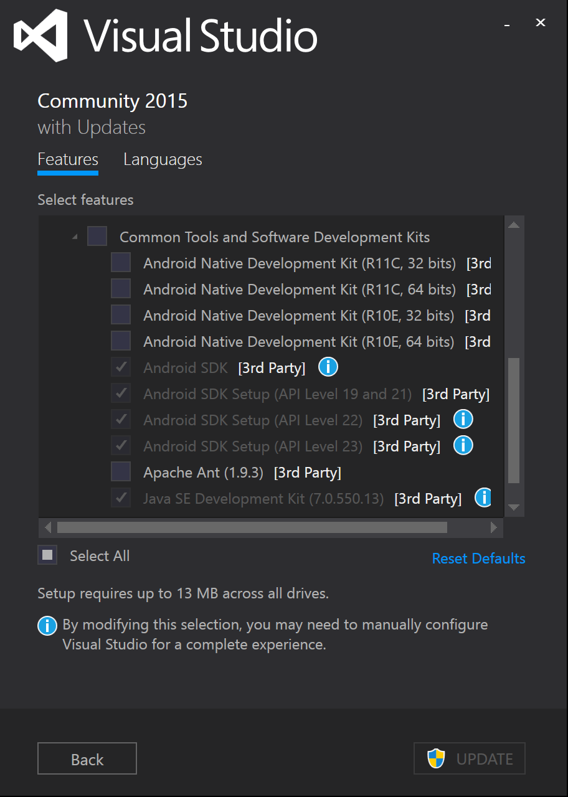
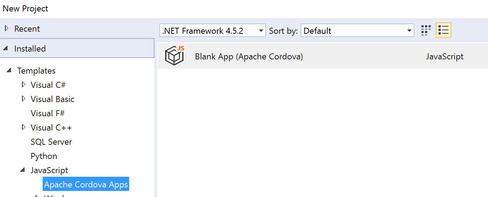
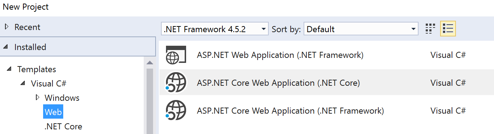

# Cordova Hosted Apps example from Microsoft's TechReady23

Code from this repo was used as a part of this demo .

## Environment 

The following technologies are needed to launch this example:

* Microsoft Visual Studio 2015 Update 3
* The VS2015 Tools for Apache Cordova extension ([Install Guide](http://taco.visualstudio.com/en-us/docs/install-vs-tools-apache-cordova/)). Be sure to check the listed dependencies:
 * Universal Windows Apps Development Tools
 * Common Tools - Android and Java Tools

* ASP.NET CORE templates and tools for Visual Studio 2015 (RC2) ([Install Guide](https://www.microsoft.com/net/download))

## Setup and Installation

1. Open a blank Cordova project in Visual Studio

2. Open the project in a file explorer
3. Copy/paste files from cordova-client into the root of the project folder. Overwrite all existing files.
4. Open a blank ASP.NET Core web app in Visual Studio

5. Publish the web app to Azure to get the URL of the web app
6. Replace the instance of "[[URL]]" in the Cordova project with the website's URL. [[URL]] appears in:
 1. config.xml (code vieW), allow-nav tag
 2. www/index.html, content-security-policy meta tag
 3. www/scripts/offline-client.js, var targetUrl 

## Play around

Build the Cordova app to an Android and Windows device to see the completed sample.

## Questions?

Email [lizhong@microsoft.com](mailto:lizhong@microsoft.com) with questions.
